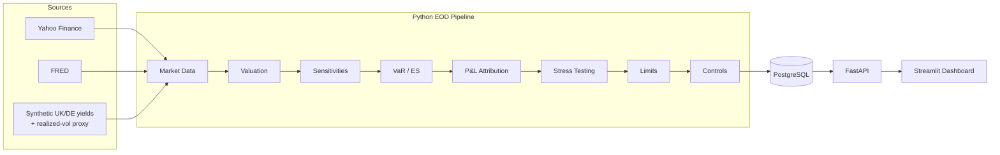

# RiskLens

A self-directed, end-to-end market risk analytics platform — from a synthetic trading book through
valuation, VaR/Expected Shortfall, sensitivities, P&L attribution, stress testing, risk limits,
data-quality controls, an educational FRTB mapping, a PostgreSQL data layer, a FastAPI backend, and a
Streamlit dashboard — built as a portfolio project for a Senior Business Analyst / Market Risk role.

**This is a learning/portfolio project, not a production or regulatory system.** Every simplification
is documented (Section 10) and nothing here should be read as production-grade risk infrastructure or
an official regulatory capital calculation.

---

## 2. Business Problem

A trading desk's risk function needs daily answers to a fixed set of questions: *How much is the book
worth? How much could we lose? What's driving that risk? Why did P&L move the way it did? What happens
in a severe scenario? Are we within our limits? Can we trust today's numbers if something looks off?*

RiskLens builds a complete, working answer to all of these end-to-end, on a small but deliberately
realistic trading book, to demonstrate the full skill set the role calls for: data modeling,
quantitative methodology, controls design, and stakeholder-facing reporting — not just one calculation
in isolation.

---

## 3. Architecture



Validation runs first (bad positions poison every downstream number); reconciliation controls run
last, right before persisting, since they need valuation/attribution to already exist. See
`docs/Full_Project_Reference.docx` for the full pipeline-ordering rationale.

---

## 4. Key Capabilities

- Hand-crafted 40-position synthetic book across Equity, Equity Option, Govt Bond, Corp Bond, FX —
  deliberately engineered with a cross-desk single-issuer concentration
- Real market data (Yahoo Finance, FRED) plus clearly-labeled synthetic/proxy series where free real
  data wasn't available
- Full-revaluation Historical VaR/ES (472 real historical scenarios) and a scoped Parametric VaR
- Position-level Delta, Gamma, Vega, DV01, CS01 — only the metrics applicable to each asset class
- P&L attribution (Actual vs. Explained vs. Residual) with explicit sign-convention handling
- 4 configurable, illustrative stress scenarios (single-factor and combined)
- Configurable GREEN/AMBER/RED risk limits, including one deliberately engineered breach
- 9 automated data-quality/reconciliation controls, demonstrated against injected bad data
- A structured, repeatable breach investigation workflow
- An educational FRTB risk-class mapping (explicitly not a capital engine)
- PostgreSQL persistence, a FastAPI layer, and a 6-page role-based Streamlit dashboard
- A 40-test automated pytest suite and a 15-case UAT document

---

## 5. Example Breach Investigation

Real output from `src/breach_investigation.py`, run against the actual portfolio:

```
BREACH DETECTED
Issuer Concentration (Gross Exposure) - Issuer: JPMorgan Chase & Co
$41,739,151 vs $35,000,000 limit (119.3% utilization)

Data Quality: PASS
Position/Value/P&L Reconciliation: PASS

Prior Exposure (positions marked at 2026-08-28 levels): $41,648,143
Current Exposure (today):                                  $41,739,151  (+0.22%)
-> Positions unchanged, exposure essentially flat day-over-day: this is a STRUCTURAL
   concentration, not a recent market spike

Primary Contributors: JPM-CB-3Y, JPM-CB-2Y, JPM-CB-10Y (Fixed Income Desk / Credit-Concentrated book),
JPM-CB-5Y (Investment Grade Credit), JPM-OPT-C-300 (Equities Desk)

Market Drivers (most recent day): ISS_JPM-CS: -1.0 bp (spread TIGHTENED, not widened);
JPM-EQ: +0.96%

Preliminary Assessment:
Likely a genuine, STRUCTURAL single-issuer concentration breach driven by position sizing,
not a data quality issue or a sudden adverse market move.
```

---

## 6. Dashboard Screenshots

*(Placeholders — run `streamlit run src/dashboard.py` and capture each page to fill these in)*

- `docs/screenshots/executive_dashboard.png` — Executive Dashboard
- `docs/screenshots/risk_explorer.png` — Risk Explorer
- `docs/screenshots/pnl_and_stress.png` — P&L & Stress
- `docs/screenshots/limits_and_breach.png` — Limits & Breach Investigation
- `docs/screenshots/data_quality.png` — Data Quality / Controls
- `docs/screenshots/frtb_explorer.png` — FRTB Explorer

---

## 7. Technology Stack

Python 3.9 · pandas / NumPy · PostgreSQL 14 · FastAPI + Uvicorn · Streamlit + Plotly · pytest ·
psycopg2 · requests

---

## 8. Data Sources

| Data | Source | Classification |
|---|---|---|
| Equity prices | Yahoo Finance | Real |
| US Treasury yields | FRED (DGS2/5/10/30) | Real |
| UK Gilt / German Bund yields | Calibrated random walk | **Synthetic** — no free daily source |
| Corporate credit spreads | FRED ICE BofA OAS by rating bucket | Real data, **rating-bucket approximation** |
| Implied volatility | 21-day rolling realized vol | **Approximation** — real IV needs a paid vendor |
| FX spot | FRED (Fed H.10) | Real |

---

## 9. Methodology (summary)

- **Valuation**: quantity×price (equity/FX), simplified annual-coupon DCF (bonds), Black-Scholes
  (options) — see `src/valuation.py`
- **VaR/ES**: full-revaluation historical simulation, order-statistic method, no distributional
  assumption; Parametric VaR fits a normal distribution to the same scenario P&L series
- **Sensitivities**: analytic Black-Scholes Greeks; DV01/CS01 via bump-and-reprice
- **P&L Attribution**: sensitivities × actual observed risk-factor changes, residual = what's left
- **Stress Testing**: hand-picked, config-driven shocks through the same revaluation engine as VaR
- **Limits/Controls**: config-driven thresholds joined against computed results at query time; 9
  discrete data-quality/reconciliation checks

Full methodology, formulas, and worked examples: `docs/Full_Project_Reference.docx`.

---

## 10. Simplifications / Limitations

- Positions are a **single hand-crafted daily snapshot**, not a live trade feed or random sample
- Bonds: annual coupon compounding, maturity rounded to the nearest year, no accrued interest, **no
  convexity**
- Corp bonds discount off the nearest available UST tenor (no curve interpolation); **DV01 and CS01
  are numerically identical per bond**, a direct consequence of one combined discount rate
- Options: European-style Black-Scholes (real listed options are American), UST-2Y used as a
  short-rate proxy, "implied vol" is actually a realized-vol proxy, **no Rho**
- FX exposure is USD-reporting-only — pairs quoted `USD/...` show zero USD-denominated FX Delta by
  construction, not a bug
- Credit spreads are rating-bucket index proxies, not true single-name spreads
- VaR/ES is 1-day, unstressed, ~2 years of history — contrast with FRTB's 97.5% ES, multiple
  liquidity horizons, and stressed calibration (Section 11 covers this further)
- Stress scenarios are illustrative/hypothetical, not calibrated to any real historical crisis
- Only 5 illustrative risk limits are configured
- **No authentication** on the API or dashboard — not suitable for production use as-is
- Automated test coverage does not yet extend to the API layer, the breach investigation workflow, or
  5 of 9 data-quality controls (full gap list: `docs/BA_Documentation_Pack.docx`, Part E)

---

## 11. FRTB Disclaimer

The FRTB module (`src/frtb_mapping.py`, dashboard's FRTB Explorer page) is an **educational mapping
only**. It labels positions with the FRTB risk class and sensitivity type they'd conceptually fall
under. It implements **no risk weights, no correlations, no correlation scenarios, no Default Risk
Charge, no Residual Risk Add-On, and no capital aggregation formula**, and produces **no capital
number, official or otherwise**. Nothing in this project should be presented as, or mistaken for, an
actual regulatory capital calculation.

---

## 12. Repository Structure

```
trading-book-risk-controls/
├── config/                  stress_scenarios.json, risk_limits.json
├── data/                    reference CSVs, raw/ and processed/ market data + results
├── docs/                    Word/Markdown BA deliverables (schema design, full reference, UAT, BA pack)
├── sql/                     schema.sql, queries.sql
├── src/                     every module (see "How to Run" for order)
└── tests/                   pytest suite + conftest.py
```

---

## 13. How to Run

```bash
python3 -m venv .venv && source .venv/bin/activate
pip install pandas numpy requests python-docx psycopg2-binary fastapi "uvicorn[standard]" streamlit plotly pytest

# Build the data, in dependency order
python src/build_portfolio.py
python src/build_market_data.py
python src/valuation.py
python src/var_es.py
python src/sensitivities.py
python src/pnl_attribution.py
python src/stress_testing.py
python src/risk_limits.py
python src/data_quality.py
python src/breach_investigation.py
python src/frtb_mapping.py

# Database (requires a running local PostgreSQL)
createdb trading_book_risk
psql -d trading_book_risk -f sql/schema.sql
python src/run_eod_pipeline.py

# Application layer
uvicorn src.api:app --port 8000 &
streamlit run src/dashboard.py
```

Dashboard: http://localhost:8501 · API docs: http://localhost:8000/docs

---

## 13a. Deployment (free tier)

This can optionally be hosted publicly, for free, across two providers:

- **Neon** ([neon.tech](https://neon.tech)) — free serverless Postgres. Auto-suspends when idle,
  auto-wakes on the next connection.
- **Render** ([render.com](https://render.com)) — free web services for both the API and the
  dashboard, deployed together from `render.yaml`. Free services sleep after ~15 min idle
  (~30-60s cold start on the next visit).

Steps:
1. Create a Neon project, copy its connection string (`postgresql://...`).
2. On Render, "New +" → "Blueprint", point it at this repo — it reads `render.yaml` and creates
   both services.
3. Set the `risklens-api` service's `DATABASE_URL` env var to the Neon connection string.
4. Once `risklens-api` has a live URL, set the `risklens-dashboard` service's `API_URL` env var to it.
5. Run `python src/run_eod_pipeline.py` once locally with `DATABASE_URL` pointed at Neon, to
   populate the schema and seed a day of results (`psql "$DATABASE_URL" -f sql/schema.sql` first).

No authentication is implemented — anyone with the link can view everything. All API endpoints are
read-only (`GET` only), so the only exposure is the synthetic demo data itself, not a write/data-loss
risk.

## 14. Testing

```bash
pytest tests/ -v
```

40 tests (unit / integration / regression markers) covering valuation, VaR/ES, sensitivities, stress,
P&L reconciliation, control detection, and limit classification — plus the financial sanity properties
(ES ≥ VaR, upward yields reduce a long bond's value, spread widening reduces a long corp bond's value,
larger positions create larger exposure). This suite caught and helped fix a real floating-point
off-by-one bug in the VaR rank-selection logic during development.

---

## 15. BA Artifacts

- `docs/Module_1_Trading_Book_Data_Model.docx` — data model design process (draft → revision → final)
- `docs/Full_Project_Reference.docx` — full methodology reference, all 11 modules, dashboard guide
- `docs/UAT_cases.md` — 15 UAT cases
- `docs/BA_Documentation_Pack.docx` — Business/Functional Requirements, Gap Analysis, Data Dictionary,
  Traceability Matrix (with gaps flagged, not assumed covered)
